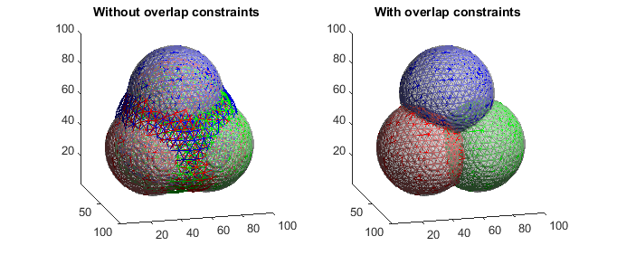

# Multi-object Graph-based Segmentation with Non-overlapping Surfaces

This is an implementation of the method described in the 2020 CVMI paper:
<ul><b>Multi-object Graph-based Segmentation with Non-overlapping Surfaces. </b> 
Patrick M. Jensen, Anders B. Dahl, Vedrana A. Dahl. 
<em>Computer Vision for Microscopy Image Analysis, 2020.</em>
</ul>

**To build:** run the `compile_mex.m` MATLAB script and it should out two mex files.

**To run:** run the `demo.m` MATLAB script after building. It should create a result which looks like:

